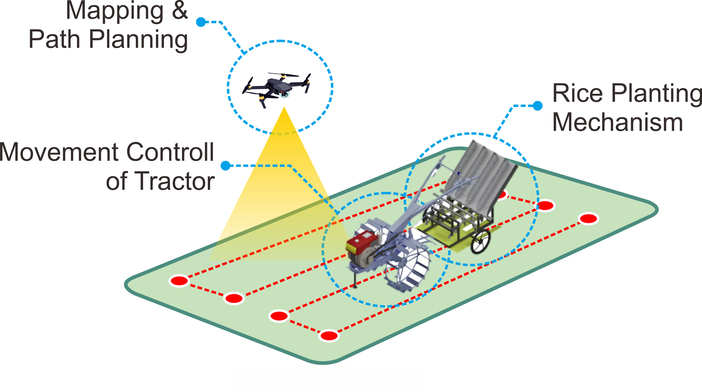
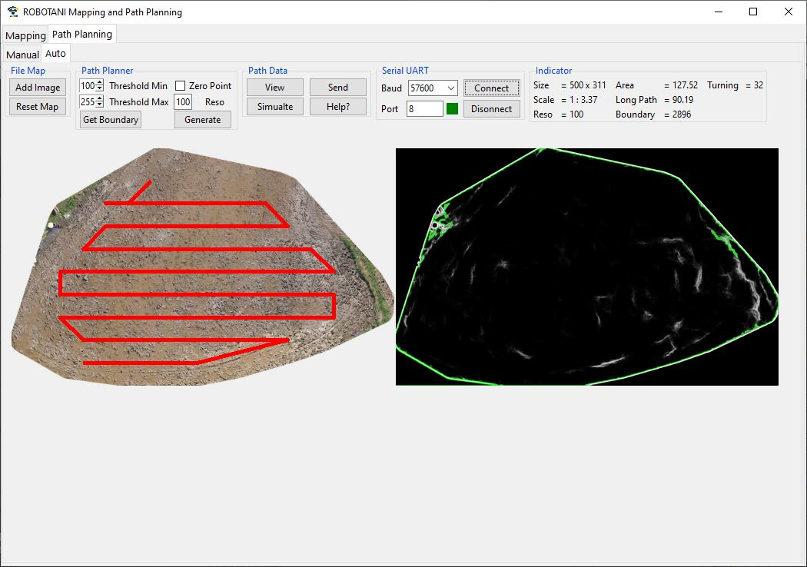
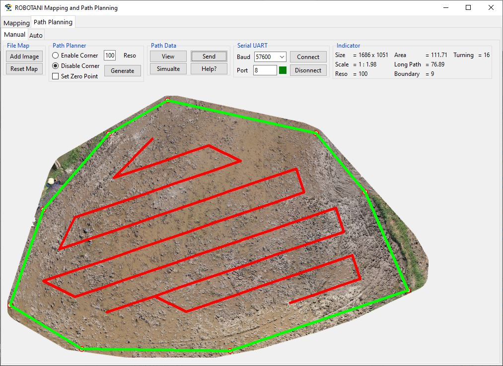

# Mapping_and_Path_Planning

ROBOTANI : Planting Path Planning and Mapping System Software is a software system used to manage image and location data that have been obtained from aerial data collection on agricultural land. The output of this software is a high-resolution map image along with GPS-based location and planting path in the form of coordinates based on GPS location.

  
  
  
  

## Software Requirements

### Windows	
Docker-Toolbox
Oracle VM VirtualBox
Kinematic Alpha
OSGeo4W64 (GDAL)
Git Bash
Visual Studio Code
### Linux
Docker
Terminal
Visual Studio Code

## Operation

### Run NodeODM
•	Open “Docker Quickstart Terminal”, wait until IP of your PC displayed. 
•	Note the machine IP
•	Run docker run -p 3000:3000 opendronemap/nodeodm
•	Wait until nodeODM started

### Run Graphical User Interface
•	Open “Administrator : Command Prompt” or “Terminal of Visual Studio Code”
•	Enter directory of code, e.g : “C:\Users\User_Name” by run
cd C:\Users\User_Name
•	Open the software by run python ROBOTANI_GUI_v3.py
•	Wait until GUI displayed. 

Read the software manual.
